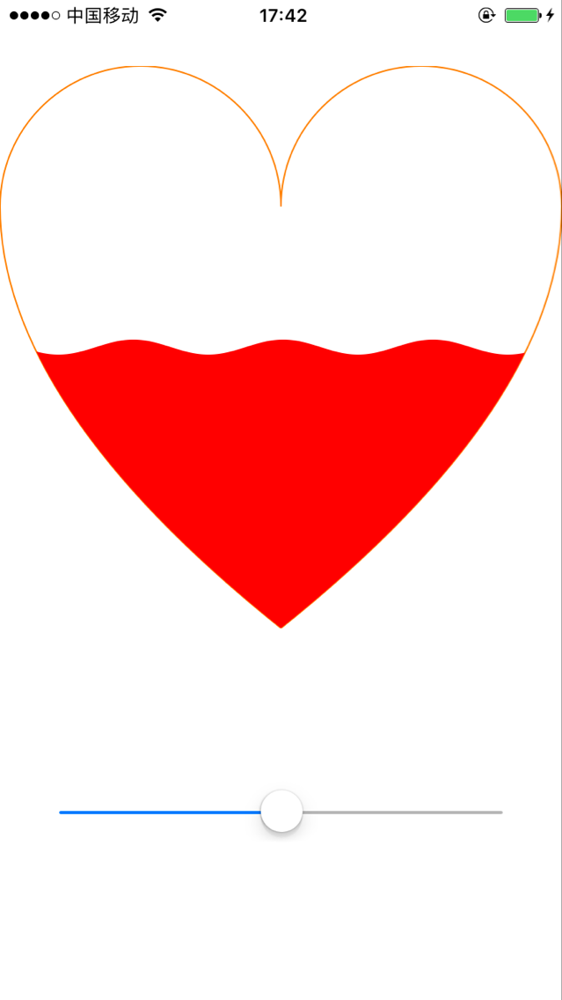
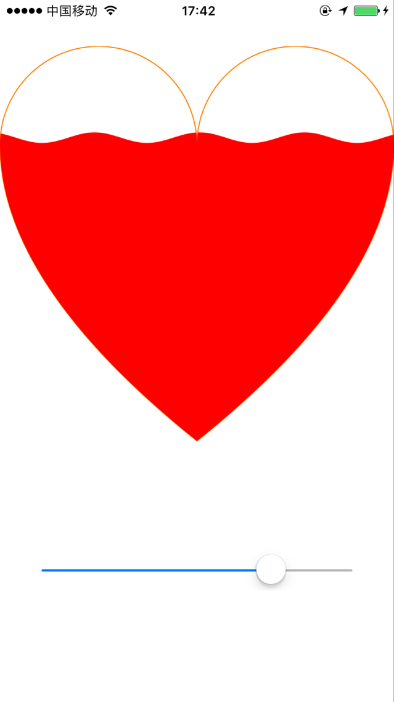

# JanyHeartView
流动的桃心💗
## 示例效果
<br/>
<br/>
```
$ gem install cocoapods
``` 
CocoaPods 0.39.0+ is required to build JanyHeartView 1.0.0+.
#Podfile</br>
To integrate JanyHeartView into your Xcode project using CocoaPods, specify it in your `Podfile`:
```
source 'https://github.com/CocoaPods/Specs.git'
platform :ios, '8.0'

target 'TargetName' do
pod 'JanyHeartView'
end

### 使用说明
// 1. 导入头文件
```objc
#import "HeartView.h"

- (void)viewDidLoad {
[super viewDidLoad];
heartView = [[HeartView alloc]initWithFrame:CGRectMake(0.f, 44.f, self.view.frame.size.width, self.view.frame.size.width)];

heartView.rate = 0.5;
heartView.lineWidth = 1;
heartView.strokeColor = [UIColor orangeColor];
heartView.fillColor = [UIColor redColor];
heartView.backgroundColor = [UIColor clearColor];
[self.view addSubview:heartView];

[self loadSlider];
}

- (void)loadSlider
{
UISlider *valueSlider = [[UISlider alloc]initWithFrame:CGRectMake((self.view.frame.size.width-300)/2, self.view.frame.size.height-150, 300, 50)];
valueSlider.minimumValue = 0.0;
valueSlider.maximumValue = 1.0;
valueSlider.value = 0.5;
[valueSlider addTarget:self action:@selector(valueChangedAction:) forControlEvents:UIControlEventValueChanged];
[self.view addSubview:valueSlider];
}

- (void)valueChangedAction:(UISlider*)slider
{
heartView.rate = slider.value;
}
```
